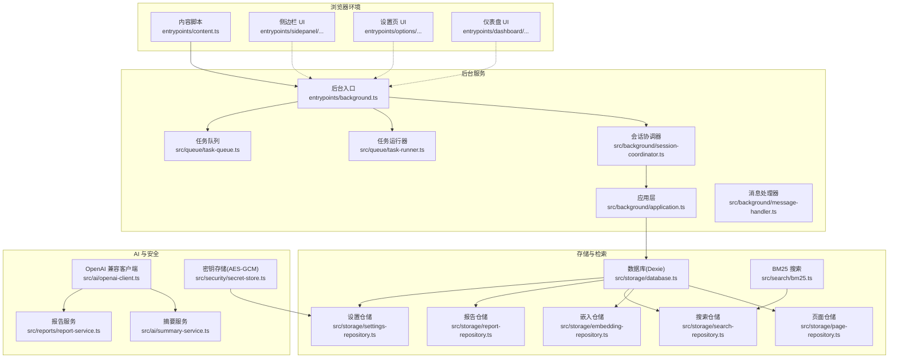
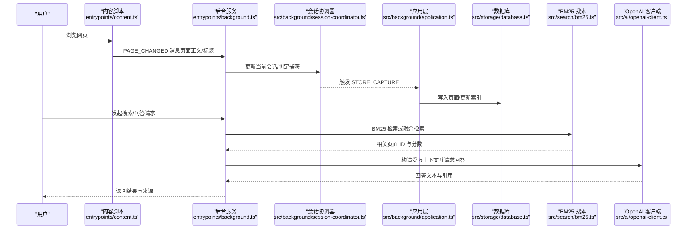
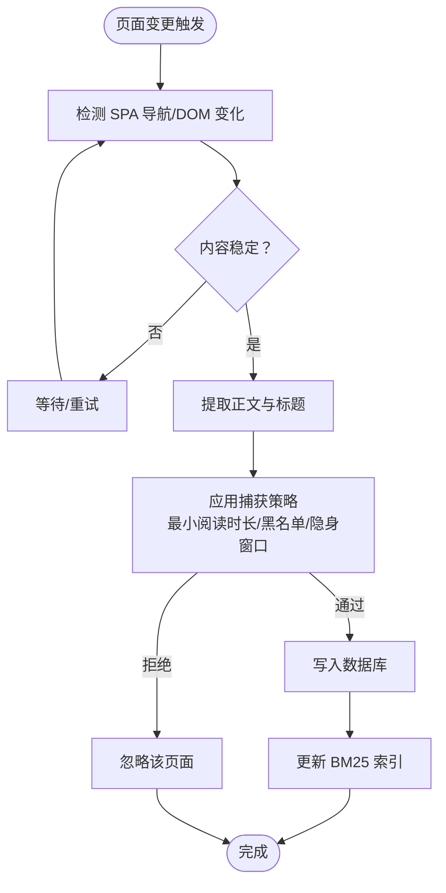
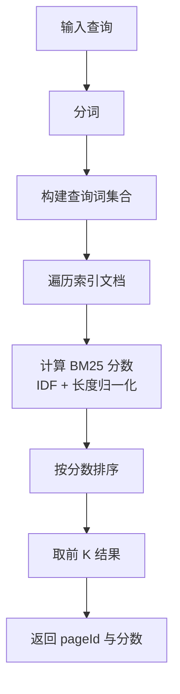
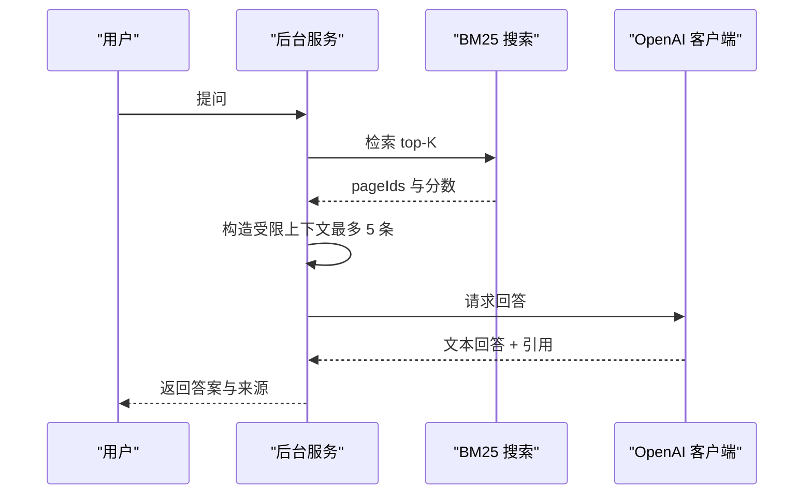
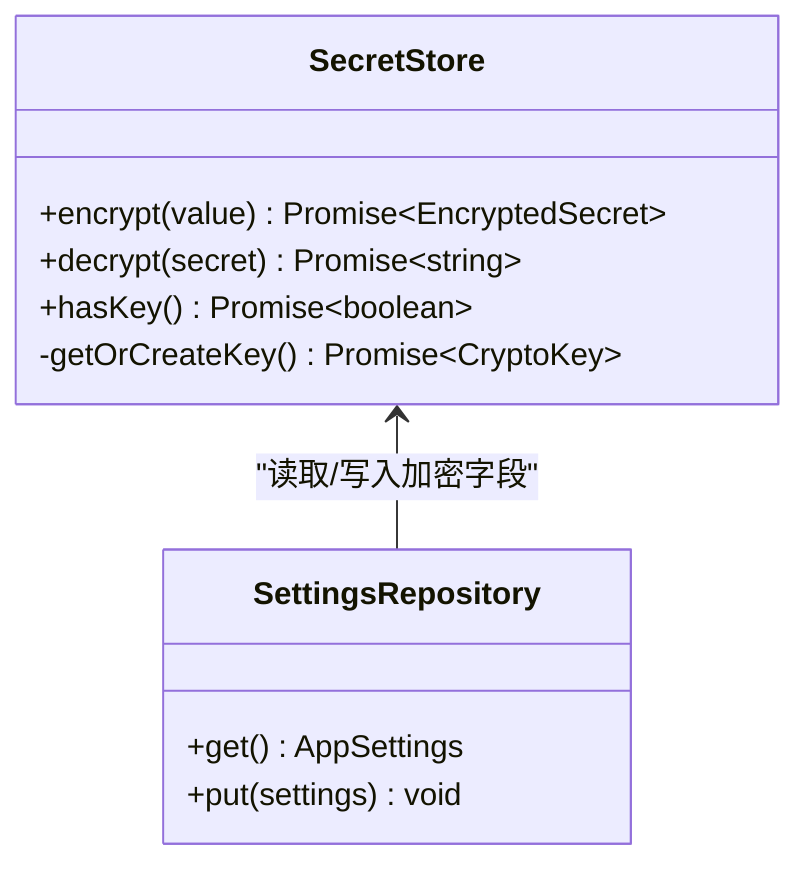
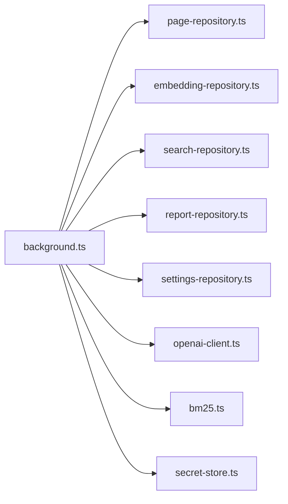

# 核心功能特性

<cite>
**本文档引用的文件**
- [README.md](file://README.md)
- [package.json](file://package.json)
- [src/shared/constants.ts](file://src/shared/constants.ts)
- [entrypoints/background.ts](file://entrypoints/background.ts)
- [entrypoints/content.ts](file://entrypoints/content.ts)
- [src/capture/capture-policy.ts](file://src/capture/capture-policy.ts)
- [src/capture/session-machine.ts](file://src/capture/session-machine.ts)
- [src/search/bm25.ts](file://src/search/bm25.ts)
- [src/ai/openai-client.ts](file://src/ai/openai-client.ts)
- [src/security/secret-store.ts](file://src/security/secret-store.ts)
</cite>

## 目录
1. [简介](#简介)
2. [项目结构](#项目结构)
3. [核心组件](#核心组件)
4. [架构总览](#架构总览)
5. [详细组件分析](#详细组件分析)
6. [依赖分析](#依赖分析)
7. [性能考虑](#性能考虑)
8. [故障排查指南](#故障排查指南)
9. [结论](#结论)
10. [附录](#附录)

## 简介
本文件面向用户与开发者，系统性梳理 BrowseMemory 的核心功能特性，覆盖 Phase 1 与 Phase 2 的关键能力，并解释技术实现原理、用户体验价值、功能协作关系与数据流转过程。重点包括：
- 自动页面捕获与记录
- IndexedDB 本地存储
- 中英文 BM25 离线搜索
- OpenAI 兼容的单轮 RAG 问答
- AES-GCM 加密 API Key
- 以及 Phase 2 的智能增强能力（可选语义搜索、离线任务队列、AI 摘要、查询重写、报告仪表盘等）

## 项目结构
BrowseMemory 采用 Chrome MV3 扩展架构，主要由以下层次构成：
- 内容脚本：监听页面变化并上报页面正文与标题
- 后台服务：会话协调、消息处理、定时任务、任务队列与任务执行
- 存储层：IndexedDB（Dexie）数据库与各仓储（Repositories）
- 搜索与 AI：BM25 索引、OpenAI 兼容客户端、摘要与报告服务
- 安全：API Key 的 AES-GCM 加密存储
- UI 层：侧边栏、设置页、仪表盘三端界面

图表来源
- [entrypoints/content.ts:1-44](file://entrypoints/content.ts#L1-L44)
- [entrypoints/background.ts:1-241](file://entrypoints/background.ts#L1-L241)
- [src/search/bm25.ts:1-166](file://src/search/bm25.ts#L1-L166)
- [src/ai/openai-client.ts:1-125](file://src/ai/openai-client.ts#L1-L125)
- [src/security/secret-store.ts:1-70](file://src/security/secret-store.ts#L1-L70)

章节来源
- [README.md:94-115](file://README.md#L94-L115)

## 核心组件
- 自动页面捕获与记录：内容脚本检测 SPA 导航与 DOM 变化，周期性上报页面正文与标题；后台会话协调器根据策略决定是否捕获。
- IndexedDB 本地存储：Dexie 管理页面、嵌入向量、搜索索引、报告与设置等数据。
- 中英文 BM25 离线搜索：基于分词与 IDF 计算的全文检索，支持标题加权与结果排序。
- OpenAI 兼容的单轮 RAG 问答：构造受限上下文（最多五条相关页面），调用兼容接口获取回答与来源引用。
- AES-GCM 加密 API Key：使用 Web Crypto API 生成与存储密钥，确保敏感信息本地加密。
- Phase 2 智能增强：可选语义搜索（向量检索 + RRF 融合）、离线任务队列（嵌入生成、摘要、报告）、AI 页面摘要、查询重写、报告仪表盘。

章节来源
- [README.md:7-26](file://README.md#L7-L26)
- [src/shared/constants.ts:12-32](file://src/shared/constants.ts#L12-L32)

## 架构总览
下图展示从页面变更到数据入库、索引更新、检索与问答的关键流程：

图表来源
- [entrypoints/content.ts:17-21](file://entrypoints/content.ts#L17-L21)
- [entrypoints/background.ts:57-66](file://entrypoints/background.ts#L57-L66)
- [entrypoints/background.ts:226-239](file://entrypoints/background.ts#L226-L239)
- [src/search/bm25.ts:125-166](file://src/search/bm25.ts#L125-L166)
- [src/ai/openai-client.ts:64-124](file://src/ai/openai-client.ts#L64-L124)

## 详细组件分析

### 自动页面捕获与记录
- 实现机制
  - 内容脚本监听 SPA 导航（pushState/replaceState/popstate）与 DOM 变化（MutationObserver），在稳定后上报页面正文与标题。
  - 后台会话协调器维护“阅读会话”，根据最小阅读时长、URL 支持性与黑名单策略决定是否捕获。
- 用户体验价值
  - 无侵入地记录用户真正关注的页面，避免隐私敏感站点被采集。
- 关键路径
  - 页面变更上报：[entrypoints/content.ts:17-21](file://entrypoints/content.ts#L17-L21)
  - 会话状态机与事件转换：[src/capture/session-machine.ts:10-69](file://src/capture/session-machine.ts#L10-L69)
  - 捕获策略判定：[src/capture/capture-policy.ts:10-20](file://src/capture/capture-policy.ts#L10-L20)

图表来源
- [entrypoints/content.ts:24-41](file://entrypoints/content.ts#L24-L41)
- [src/capture/session-machine.ts:31-41](file://src/capture/session-machine.ts#L31-L41)
- [src/capture/capture-policy.ts:14-19](file://src/capture/capture-policy.ts#L14-L19)

章节来源
- [entrypoints/content.ts:1-44](file://entrypoints/content.ts#L1-L44)
- [src/capture/session-machine.ts:1-69](file://src/capture/session-machine.ts#L1-L69)
- [src/capture/capture-policy.ts:1-21](file://src/capture/capture-policy.ts#L1-L21)

### IndexedDB 本地存储
- 设计要点
  - 使用 Dexie 管理多张表（页面、嵌入向量、搜索索引、报告、设置、加密密钥），通过仓储模式隔离数据访问。
  - 默认保留 90 天，支持 TTL 清理与增量索引更新。
- 用户体验价值
  - 数据完全保留在本地，无需网络即可进行搜索与摘要；升级不影响既有数据。
- 关键路径
  - 默认设置与常量：[src/shared/constants.ts:10-24](file://src/shared/constants.ts#L10-L24)
  - 数据库与仓储：[src/storage/database.ts](file://src/storage/database.ts)（文件存在但未展开）
  - 后台初始化与清理：[entrypoints/background.ts:166-168](file://entrypoints/background.ts#L166-L168)

章节来源
- [src/shared/constants.ts:10-24](file://src/shared/constants.ts#L10-L24)
- [entrypoints/background.ts:166-168](file://entrypoints/background.ts#L166-L168)

### 中英文 BM25 离线搜索
- 实现原理
  - 分词后统计词频，计算逆文档频率（IDF），结合长度归一化得到 BM25 分数；标题词频加权更高。
  - 支持文档增删改（upsert/remove），在线索引与离线持久化之间切换。
- 用户体验价值
  - 无需联网即可快速定位相关内容，支持中英文混合查询。
- 关键路径
  - BM25 索引构建与查询：[src/search/bm25.ts:38-166](file://src/search/bm25.ts#L38-L166)
  - 分词模块：[src/search/tokenize.ts](file://src/search/tokenize.ts)（文件存在但未展开）

图表来源
- [src/search/bm25.ts:125-166](file://src/search/bm25.ts#L125-L166)

章节来源
- [src/search/bm25.ts:1-166](file://src/search/bm25.ts#L1-L166)

### OpenAI 兼容的单轮 RAG 问答
- 实现原理
  - 依据 BM25 结果选取最多五条最相关的页面，构造受限上下文，调用兼容接口获取回答。
  - 错误分类（鉴权、速率限制、网络、超时、提供商错误）便于前端提示与降级。
- 用户体验价值
  - 在本地知识库基础上进行单轮问答，支持来源引用，提升可信度。
- 关键路径
  - OpenAI 兼容客户端与错误处理：[src/ai/openai-client.ts:56-124](file://src/ai/openai-client.ts#L56-L124)
  - RAG 上下文构造与调用（见 README 的“单轮 RAG 问答”描述）：[README.md:12](file://README.md#L12)

图表来源
- [src/ai/openai-client.ts:64-124](file://src/ai/openai-client.ts#L64-L124)
- [src/search/bm25.ts:125-166](file://src/search/bm25.ts#L125-L166)

章节来源
- [src/ai/openai-client.ts:1-125](file://src/ai/openai-client.ts#L1-L125)
- [README.md:12](file://README.md#L12)

### AES-GCM 加密 API Key
- 实现原理
  - 首次使用时生成 AES-GCM 密钥并持久化；每次加密随机生成 96 位 IV，使用 GCM 模式加密明文。
  - 解密时使用相同密钥与 IV 还原明文；设置仓储负责读取与写入加密字段。
- 用户体验价值
  - 敏感信息本地加密存储，降低泄露风险；用户可随时更换或删除密钥。
- 关键路径
  - 密钥生成与加解密：[src/security/secret-store.ts:25-70](file://src/security/secret-store.ts#L25-L70)
  - 默认设置中的密钥复用选项：[src/shared/constants.ts:18-23](file://src/shared/constants.ts#L18-L23)

图表来源
- [src/security/secret-store.ts:25-70](file://src/security/secret-store.ts#L25-L70)
- [src/shared/constants.ts:18-23](file://src/shared/constants.ts#L18-L23)

章节来源
- [src/security/secret-store.ts:1-70](file://src/security/secret-store.ts#L1-L70)
- [src/shared/constants.ts:18-23](file://src/shared/constants.ts#L18-L23)

### Phase 2 智能增强（可选）
- 语义搜索（可选）：接入 Embedding API（如 BAAI/bge-m3），与 BM25 通过 RRF 融合排序，提供更精准的搜索结果；不可用时静默降级为纯 BM25。
- 离线任务队列：Embedding 生成、页面摘要、报告生成均通过持久化任务队列异步调度，支持最多 3 次重试与指数退避。
- AI 页面摘要：新入库页面自动生成 100 字以内摘要。
- 查询重写：多轮对话中自动将代词还原为具体实体。
- 报告仪表盘：日报/周报/月报自动生成，在侧边栏内以 iframe 蒙层展示。
- 混合检索：BM25 + 向量检索 + RRF 融合，Embedding 不可用时静默降级为纯 BM25。
- 设置页增强：语义搜索配置卡片（开关、地址、模型、Key 复用、索引状态）、报告设置卡片。
- 国际化：支持 10 种语言。

章节来源
- [README.md:17-26](file://README.md#L17-L26)

## 依赖分析
- 组件耦合
  - 内容脚本与后台通过消息协议解耦；后台通过仓储与数据库交互，避免直接依赖 UI。
  - 搜索与 AI 通过仓储与应用层解耦，便于替换实现。
- 外部依赖
  - React/Dexie/Tailwind 等运行时依赖；测试框架 Vitest 与 fake-indexeddb 用于单元测试。
- 关键依赖路径
  - 后台导入仓储与服务：[entrypoints/background.ts:16-25](file://entrypoints/background.ts#L16-L25)
  - 包管理与脚本：[package.json:14-48](file://package.json#L14-L48)

图表来源
- [entrypoints/background.ts:16-25](file://entrypoints/background.ts#L16-L25)

章节来源
- [entrypoints/background.ts:16-25](file://entrypoints/background.ts#L16-L25)
- [package.json:14-48](file://package.json#L14-L48)

## 性能考虑
- 捕获节流：内容脚本对页面变更进行去抖，避免高频重复上报。
- 检索优化：BM25 仅对查询词集合进行遍历，减少无效计算；标题词频加权提升命中质量。
- 异步处理：任务队列批处理与指数退避，避免高峰时段阻塞。
- 存储策略：Dexie 增量更新索引与 TTL 清理，控制数据库体积增长。
- 传输优化：问答仅发送受限上下文，降低带宽与延迟。

## 故障排查指南
- API Key 无效或鉴权失败
  - 现象：问答报错提示鉴权失败。
  - 排查：确认设置页中 API 地址、模型与 Key 是否正确；检查密钥是否已加密存储。
  - 参考：[src/ai/openai-client.ts:82-87](file://src/ai/openai-client.ts#L82-L87)，[src/security/secret-store.ts:42-50](file://src/security/secret-store.ts#L42-L50)
- 请求过于频繁/速率限制
  - 现象：提示请求过于频繁。
  - 排查：降低请求频率或调整提供商配额。
  - 参考：[src/ai/openai-client.ts:88-93](file://src/ai/openai-client.ts#L88-L93)
- 服务超时/网络异常
  - 现象：AI 服务响应超时或无法连接。
  - 排查：检查网络连通性与代理设置；确认 Base URL 正确。
  - 参考：[src/ai/openai-client.ts:112-119](file://src/ai/openai-client.ts#L112-L119)
- 搜索结果为空
  - 现象：BM25 无匹配结果。
  - 排查：确认已捕获足够页面；检查黑名单与最小阅读时长设置。
  - 参考：[src/capture/capture-policy.ts:14-19](file://src/capture/capture-policy.ts#L14-L19)，[src/search/bm25.ts:132-134](file://src/search/bm25.ts#L132-L134)
- 语义搜索不可用
  - 现象：开启语义搜索后仍为纯 BM25。
  - 排查：确认 Embedding 地址、模型与 Key；检查任务队列是否正常运行。
  - 参考：[README.md:70-80](file://README.md#L70-L80)，[entrypoints/background.ts:74-102](file://entrypoints/background.ts#L74-L102)

章节来源
- [src/ai/openai-client.ts:82-119](file://src/ai/openai-client.ts#L82-L119)
- [src/security/secret-store.ts:42-50](file://src/security/secret-store.ts#L42-L50)
- [src/capture/capture-policy.ts:14-19](file://src/capture/capture-policy.ts#L14-L19)
- [src/search/bm25.ts:132-134](file://src/search/bm25.ts#L132-L134)
- [README.md:70-80](file://README.md#L70-L80)
- [entrypoints/background.ts:74-102](file://entrypoints/background.ts#L74-L102)

## 结论
BrowseMemory 将“本地优先”与“智能增强”有机结合：以 IndexedDB 为核心的数据层保证隐私与离线可用，以 BM25 为基础的检索满足日常需求，以 OpenAI 兼容接口与受限上下文实现可控的 RAG 问答；配合 AES-GCM 加密与可选的语义搜索、任务队列与报告仪表盘，形成从“记录—检索—问答—总结”的完整闭环。对于用户而言，它提供了即开即用的浏览记忆能力；对于开发者而言，清晰的模块划分与仓储抽象便于扩展与维护。

## 附录
- 使用场景与最佳实践
  - 场景一：日常学习/研究
    - 建议：开启最小阅读时长与黑名单过滤，定期查看报告仪表盘。
  - 场景二：写作/整理
    - 建议：启用语义搜索与 AI 摘要，利用受限上下文进行单轮问答。
  - 场景三：隐私敏感工作
    - 建议：仅在受信网络使用 API Key；定期清理过期数据。
- 升级与迁移
  - 从 Phase 1 升级至 Phase 2：数据库自动迁移（Dexie v3），所有功能保持不变。
- 隐私声明
  - 浏览正文、索引与设置保存在扩展自身的 IndexedDB；API Key 使用 AES-GCM 加密；仅在用户提问时发送受限上下文；不申请历史、Cookie 或 webRequest 权限。

章节来源
- [README.md:117-135](file://README.md#L117-L135)