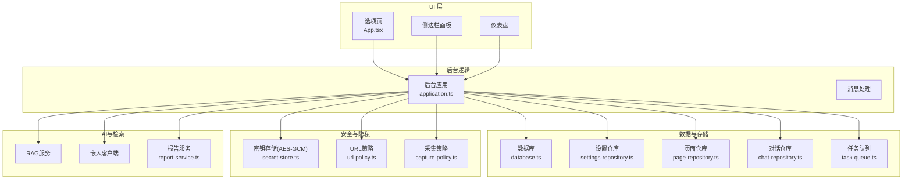
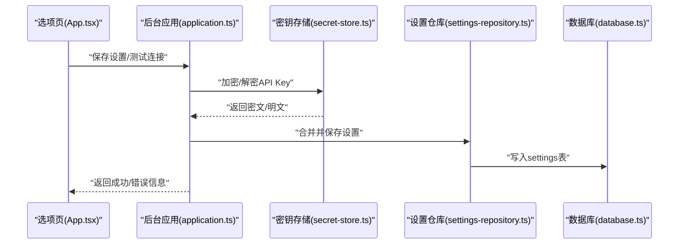
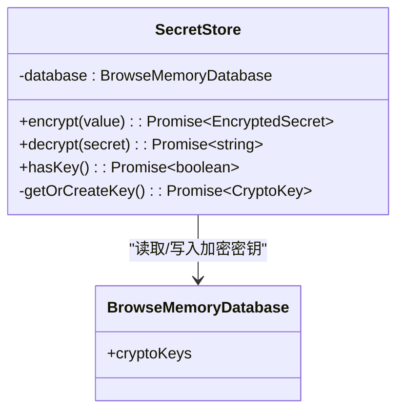
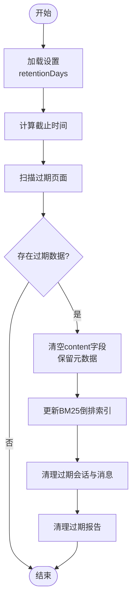
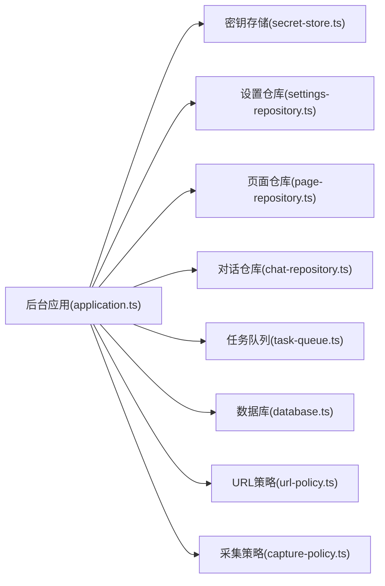

# 隐私与安全策略

<cite>
**本文引用的文件**
- [src/security/secret-store.ts](file://src/security/secret-store.ts)
- [src/background/application.ts](file://src/background/application.ts)
- [src/storage/settings-repository.ts](file://src/storage/settings-repository.ts)
- [src/shared/constants.ts](file://src/shared/constants.ts)
- [src/shared/types.ts](file://src/shared/types.ts)
- [src/shared/url-policy.ts](file://src/shared/url-policy.ts)
- [src/storage/database.ts](file://src/storage/database.ts)
- [src/storage/page-repository.ts](file://src/storage/page-repository.ts)
- [src/storage/chat-repository.ts](file://src/storage/chat-repository.ts)
- [src/capture/capture-policy.ts](file://src/capture/capture-policy.ts)
- [src/queue/task-queue.ts](file://src/queue/task-queue.ts)
- [src/reports/report-service.ts](file://src/reports/report-service.ts)
- [entrypoints/options/App.tsx](file://entrypoints/options/App.tsx)
- [wxt.config.ts](file://wxt.config.ts)
- [package.json](file://package.json)
- [tests/security/secret-store.test.ts](file://tests/security/secret-store.test.ts)
- [website/index.html](file://website/index.html)
</cite>

## 目录
1. [引言](#引言)
2. [项目结构](#项目结构)
3. [核心组件](#核心组件)
4. [架构总览](#架构总览)
5. [详细组件分析](#详细组件分析)
6. [依赖关系分析](#依赖关系分析)
7. [性能考量](#性能考量)
8. [故障排查指南](#故障排查指南)
9. [结论](#结论)
10. [附录](#附录)

## 引言
本策略文档面向BrowseMemory项目，系统阐述其隐私保护设计理念与实现措施，覆盖本地存储策略、数据最小化原则、用户控制机制、离线优先设计、数据生命周期管理、扩展权限设计原则以及隐私设置配置与最佳实践。特别地，本文深入解析AES-GCM加密API Key的实现细节与安全优势，并结合代码级证据说明各模块在数据采集、存储、使用、清理等环节中的安全考虑。

## 项目结构
BrowseMemory采用分层清晰的前端扩展架构：入口UI（选项页、面板、仪表盘）、后台应用逻辑、内容脚本、数据库与仓库层、AI与检索服务、任务队列与报告生成等模块协同工作。整体以“本地优先、最小权限”为核心设计原则，所有用户数据均保存于浏览器端IndexedDB中，不上传至任何服务器。

图表来源
- [src/background/application.ts:29-63](file://src/background/application.ts#L29-L63)
- [src/storage/database.ts:34-76](file://src/storage/database.ts#L34-L76)
- [src/security/secret-store.ts:25-68](file://src/security/secret-store.ts#L25-L68)
- [src/shared/url-policy.ts:13-39](file://src/shared/url-policy.ts#L13-L39)
- [src/capture/capture-policy.ts:10-20](file://src/capture/capture-policy.ts#L10-L20)
- [src/queue/task-queue.ts:12-46](file://src/queue/task-queue.ts#L12-L46)
- [src/reports/report-service.ts:157-162](file://src/reports/report-service.ts#L157-L162)

章节来源
- [src/background/application.ts:29-63](file://src/background/application.ts#L29-L63)
- [src/storage/database.ts:34-76](file://src/storage/database.ts#L34-L76)
- [src/shared/url-policy.ts:13-39](file://src/shared/url-policy.ts#L13-L39)
- [src/capture/capture-policy.ts:10-20](file://src/capture/capture-policy.ts#L10-L20)

## 核心组件
- 密钥存储与加密（AES-GCM）
  - 使用Web Crypto API的AES-GCM对称加密，密钥不可导出，确保API Key在本地安全存储与传输。
  - 加密时随机生成12字节IV，解密时按Base64还原IV，保证每次加密的唯一性与完整性校验。
- 数据库与仓库
  - 基于Dexie的IndexedDB封装，包含页面、BM25倒排索引、设置、加密密钥、聊天会话与消息、嵌入向量、任务队列、报告等表。
  - 提供按日期与保留期的过期清理，避免无界增长。
- 设置与策略
  - 默认保留天数、黑名单域名模式、最小阅读时长等策略由设置仓库持久化，支持一键清空全部数据。
- 权限与URL策略
  - 扩展权限最小化，仅声明必要权限；URL规范化与黑名单过滤减少无关数据采集。
- 任务队列与报告
  - 异步任务队列支持去重、重试与退避，报告服务按需生成，避免在线请求阻塞。

章节来源
- [src/security/secret-store.ts:25-68](file://src/security/secret-store.ts#L25-L68)
- [src/storage/database.ts:34-76](file://src/storage/database.ts#L34-L76)
- [src/storage/settings-repository.ts:8-55](file://src/storage/settings-repository.ts#L8-L55)
- [src/shared/constants.ts:10-24](file://src/shared/constants.ts#L10-L24)
- [src/shared/url-policy.ts:13-39](file://src/shared/url-policy.ts#L13-L39)
- [src/queue/task-queue.ts:12-46](file://src/queue/task-queue.ts#L12-L46)
- [src/reports/report-service.ts:157-162](file://src/reports/report-service.ts#L157-L162)

## 架构总览
下图展示从用户操作到后台应用、再到数据库与安全模块的调用链路，体现“本地优先、最小权限、可撤销”的隐私设计。

图表来源
- [entrypoints/options/App.tsx:127-142](file://entrypoints/options/App.tsx#L127-L142)
- [src/background/application.ts:115-129](file://src/background/application.ts#L115-L129)
- [src/security/secret-store.ts:28-50](file://src/security/secret-store.ts#L28-L50)
- [src/storage/settings-repository.ts:19-23](file://src/storage/settings-repository.ts#L19-L23)
- [src/storage/database.ts:34-76](file://src/storage/database.ts#L34-L76)

## 详细组件分析

### 组件A：密钥存储与AES-GCM加密
- 设计理念
  - API Key作为高敏数据，采用非导出密钥（non-extractable）的AES-GCM对称加密，密钥仅存在于浏览器内存与Web Crypto上下文中。
  - 每次加密生成随机IV，解密时严格匹配IV，确保机密性与完整性。
- 实现要点
  - 生成密钥时禁用导出标志，写入数据库的仅为CryptoKey句柄；解密时复用同一密钥。
  - 对称加密参数为AES-GCM，密钥长度256位，IV长度12字节。
- 安全优势
  - 即使数据库被访问，也无法直接提取密钥；密文无法在不拥有密钥的情况下解密。
  - IV随机性与完整性校验防止重放与篡改。
- 测试验证
  - 单元测试验证密文不包含原始密钥值，且密钥不可导出。

图表来源
- [src/security/secret-store.ts:25-68](file://src/security/secret-store.ts#L25-L68)
- [src/storage/database.ts:29-32](file://src/storage/database.ts#L29-L32)

章节来源
- [src/security/secret-store.ts:25-68](file://src/security/secret-store.ts#L25-L68)
- [src/shared/types.ts:1-4](file://src/shared/types.ts#L1-L4)
- [tests/security/secret-store.test.ts:17-25](file://tests/security/secret-store.test.ts#L17-L25)

### 组件B：数据生命周期管理
- 数据采集
  - 采集策略基于URL支持性、黑名单过滤、最小阅读时长与非隐身窗口条件，遵循数据最小化原则。
- 存储
  - 页面内容与索引分离存储，BM25倒排索引仅存词项与倒排列表，避免冗余。
- 使用
  - 通过设置控制是否启用嵌入与摘要任务，AI调用仅在用户显式配置后触发。
- 清理
  - 按保留天数清理页面、聊天会话与消息、报告；页面内容清空但保留元数据与索引条目同步更新。
- 过期清理流程

图表来源
- [src/background/application.ts:65-72](file://src/background/application.ts#L65-L72)
- [src/storage/page-repository.ts:148-197](file://src/storage/page-repository.ts#L148-L197)
- [src/storage/chat-repository.ts:46-71](file://src/storage/chat-repository.ts#L46-L71)
- [src/reports/report-service.ts:30-38](file://src/reports/report-service.ts#L30-L38)

章节来源
- [src/capture/capture-policy.ts:10-20](file://src/capture/capture-policy.ts#L10-L20)
- [src/shared/url-policy.ts:55-62](file://src/shared/url-policy.ts#L55-L62)
- [src/storage/page-repository.ts:148-197](file://src/storage/page-repository.ts#L148-L197)
- [src/storage/chat-repository.ts:46-71](file://src/storage/chat-repository.ts#L46-L71)
- [src/reports/report-service.ts:30-38](file://src/reports/report-service.ts#L30-L38)

### 组件C：扩展权限设计原则
- 权限清单
  - 仅声明tabs、activeTab、storage、alarms、sidePanel等必要权限，未申请历史、cookies或网络流量权限。
- 设计原则
  - 最小权限：只授予完成功能所必需的权限。
  - 明确用途：权限用于页面内容捕获、本地存储、定时任务与侧边栏交互。
  - 用户可控：通过设置页禁用功能、清空数据，实现完全可控的隐私边界。

章节来源
- [wxt.config.ts:9-10](file://wxt.config.ts#L9-L10)
- [package.json:14-24](file://package.json#L14-L24)

### 组件D：离线优先与用户控制
- 离线优先
  - 检索与问答在本地完成，AI调用仅在用户显式配置API Key后进行；未配置时仍可进行本地搜索与摘要。
- 用户控制
  - 选项页提供语言、最小阅读时长、黑名单、保留天数、AI服务地址与模型、嵌入开关与回填、报告生成等全面控制。
  - 支持一键清空全部数据，立即释放存储空间并移除索引。

章节来源
- [entrypoints/options/App.tsx:240-491](file://entrypoints/options/App.tsx#L240-L491)
- [src/background/application.ts:178-251](file://src/background/application.ts#L178-L251)
- [src/storage/settings-repository.ts:25-55](file://src/storage/settings-repository.ts#L25-L55)

### 组件E：任务队列与异步处理
- 去重与幂等
  - 同类型同负载的任务不会重复入队，避免重复计算。
- 重试与退避
  - 失败任务按指数退避重试，超过最大重试次数后标记失败，避免无限循环。
- 清理策略
  - 成功任务保留7天以便审计，到期自动清理。

章节来源
- [src/queue/task-queue.ts:15-46](file://src/queue/task-queue.ts#L15-L46)
- [src/queue/task-queue.ts:71-106](file://src/queue/task-queue.ts#L71-L106)
- [src/queue/task-queue.ts:114-124](file://src/queue/task-queue.ts#L114-L124)

### 组件F：报告与多语言支持
- 报告生成
  - 按日/周/月聚合浏览记录，调用AI生成报告；支持强制重生成覆盖旧报告。
- 多语言
  - 通过本地化字符串与语言指令确保输出语言一致，避免跨语言混淆。

章节来源
- [src/reports/report-service.ts:164-215](file://src/reports/report-service.ts#L164-L215)
- [src/reports/report-service.ts:217-269](file://src/reports/report-service.ts#L217-L269)
- [src/reports/report-service.ts:271-322](file://src/reports/report-service.ts#L271-L322)

## 依赖关系分析
- 组件耦合
  - 后台应用聚合多个仓库与服务，形成高内聚低耦合的控制中心。
  - 密钥存储独立于业务逻辑，仅暴露加密/解密接口，降低泄露面。
- 外部依赖
  - Web Crypto API提供原生加密能力；Dexie提供IndexedDB抽象；React用于UI构建。
- 权限与数据流
  - 权限最小化，数据流单向：UI -> 后台 -> 本地存储；AI调用受控触发。

图表来源
- [src/background/application.ts:29-63](file://src/background/application.ts#L29-L63)
- [src/security/secret-store.ts:25-68](file://src/security/secret-store.ts#L25-L68)
- [src/storage/settings-repository.ts:8-55](file://src/storage/settings-repository.ts#L8-L55)
- [src/storage/page-repository.ts:43-103](file://src/storage/page-repository.ts#L43-L103)
- [src/storage/chat-repository.ts:8-101](file://src/storage/chat-repository.ts#L8-L101)
- [src/queue/task-queue.ts:12-46](file://src/queue/task-queue.ts#L12-L46)
- [src/storage/database.ts:34-76](file://src/storage/database.ts#L34-L76)
- [src/shared/url-policy.ts:13-39](file://src/shared/url-policy.ts#L13-L39)
- [src/capture/capture-policy.ts:10-20](file://src/capture/capture-policy.ts#L10-L20)

## 性能考量
- 本地计算优先：全文检索与摘要在本地完成，减少网络往返。
- 增量索引更新：页面更新时仅增量维护BM25倒排索引，避免全量重建。
- 异步任务：嵌入与摘要通过任务队列异步执行，不影响主线程响应。
- 存储清理：定期清理过期数据，保持数据库规模稳定。

## 故障排查指南
- API Key相关问题
  - 若提示缺少API Key，请在选项页填写并保存；测试连接按钮可用于验证可用性。
  - 嵌入API Key可与聊天Key复用，或单独配置，具体取决于设置。
- 数据清理
  - 如需彻底清除本地数据，可在选项页确认清空，系统将清理所有表并释放存储。
- 任务失败
  - 查看任务队列状态，失败任务将按退避策略重试；必要时手动触发回填。

章节来源
- [entrypoints/options/App.tsx:144-159](file://entrypoints/options/App.tsx#L144-L159)
- [src/background/application.ts:115-129](file://src/background/application.ts#L115-L129)
- [src/background/application.ts:256-258](file://src/background/application.ts#L256-L258)
- [src/queue/task-queue.ts:108-124](file://src/queue/task-queue.ts#L108-L124)

## 结论
BrowseMemory通过“本地优先、最小权限、数据最小化、用户可控”的设计，构建了可信的隐私与安全基线。AES-GCM加密API Key、严格的采集与清理策略、最小权限的扩展授权、以及完善的用户控制界面，共同构成了用户对BrowseMemory隐私安全的信任基础。

## 附录
- 隐私承诺与网站说明
  - 网站明确强调“默认本地存储、加密密钥、用户掌控、显式AI设置”，并与源码实现一一对应。

章节来源
- [website/index.html:248-278](file://website/index.html#L248-L278)