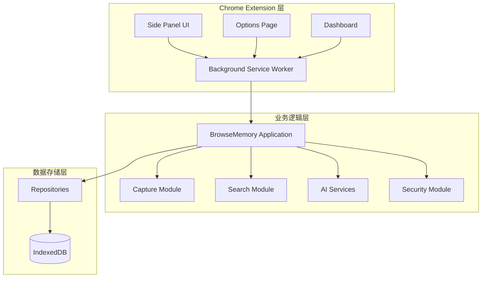
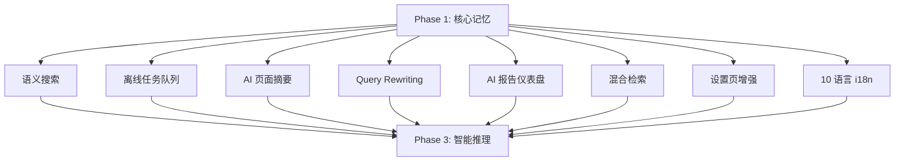
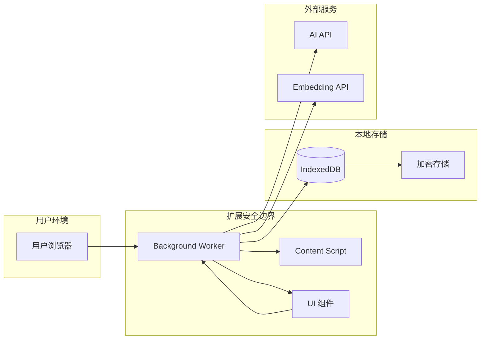

# 项目介绍与愿景

<cite>
**本文档引用的文件**
- [README.md](file://README.md)
- [package.json](file://package.json)
- [docs/superpowers/plans/2026-06-09-phase-1-mvp.md](file://docs/superpowers/plans/2026-06-09-phase-1-mvp.md)
- [docs/superpowers/specs/2026-06-09-phase-1-mvp-design.md](file://docs/superpowers/specs/2026-06-09-phase-1-mvp-design.md)
- [docs/superpowers/plans/2026-06-10-phase-1-completeness-fixes.md](file://docs/superpowers/plans/2026-06-10-phase-1-completeness-fixes.md)
- [docs/superpowers/specs/2026-06-10-phase-1-completeness-fixes-design.md](file://docs/superpowers/specs/2026-06-10-phase-1-completeness-fixes-design.md)
- [entrypoints/background.ts](file://entrypoints/background.ts)
- [src/background/application.ts](file://src/background/application.ts)
- [src/ai/rag-service.ts](file://src/ai/rag-service.ts)
- [entrypoints/sidepanel/App.tsx](file://entrypoints/sidepanel/App.tsx)
- [entrypoints/dashboard/App.tsx](file://entrypoints/dashboard/App.tsx)
- [src/shared/types.ts](file://src/shared/types.ts)
- [src/shared/constants.ts](file://src/shared/constants.ts)
- [website/README.md](file://website/README.md)
</cite>

## 目录
1. [项目简介](#项目简介)
2. [核心使命与价值主张](#核心使命与价值主张)
3. [解决的核心问题](#解决的核心问题)
4. [项目架构概览](#项目架构概览)
5. [Phase 1 功能详解](#phase-1-功能详解)
6. [Phase 2 智能增强规划](#phase-2-智能增强规划)
7. [个人知识管理的独特定位](#个人知识管理的独特定位)
8. [长期愿景与发展路径](#长期愿景与发展路径)
9. [用户体验与设计理念](#用户体验与设计理念)
10. [隐私保护与安全承诺](#隐私保护与安全承诺)
11. [技术实现亮点](#技术实现亮点)
12. [总结](#总结)

## 项目简介

BrowseMemory 是一个本地优先的 Chrome 浏览记忆扩展，致力于帮助用户更好地管理和回忆在线阅读内容。该项目采用 Chrome MV3 架构，通过智能的页面采集、本地存储和检索机制，为用户提供无缝的数字阅读体验。

### 项目特色

- **本地优先**：所有数据存储在扩展自身的 IndexedDB 中，确保用户隐私安全
- **离线可用**：支持完全离线的 BM25 搜索和基础功能
- **智能增强**：结合传统 BM25 搜索与现代 AI 技术，提供多层次的检索体验
- **隐私至上**：不申请敏感权限，不访问历史记录，数据完全本地化

**章节来源**
- [README.md:1-135](file://README.md#L1-L135)
- [package.json:1-49](file://package.json#L1-L49)

## 核心使命与价值主张

### 核心使命

BrowseMemory 的核心使命是"让每一次在线阅读都有意义"。我们相信，在信息爆炸的时代，用户需要的不仅仅是海量的信息，更需要有效的记忆和检索能力。

### 价值主张

1. **记忆增强**：自动记录用户的阅读轨迹和思考过程
2. **智能检索**：提供快速准确的跨平台内容检索
3. **知识沉淀**：帮助用户建立个人化的知识管理体系
4. **隐私保护**：确保所有数据都属于用户自己

### 目标用户

- 需要管理大量在线学习资料的学生和研究人员
- 经常进行深度阅读的专业人士
- 希望建立个人知识库的内容创作者
- 注重隐私保护的数字原住民

## 解决的核心问题

### 用户痛点分析

1. **信息分散**：阅读的内容散落在各个网站和应用中，难以统一管理
2. **记忆易忘**：长时间后对之前读过的内容失去印象
3. **检索困难**：想要查找特定信息时无从下手
4. **隐私担忧**：担心第三方服务会收集和分析自己的阅读习惯

### BrowseMemory 的解决方案

#### 问题一：信息分散
**解决方案**：自动采集和存储用户在浏览过程中产生的有价值内容，形成统一的知识库

#### 问题二：记忆易忘  
**解决方案**：通过结构化的存储和智能提醒机制，帮助用户巩固记忆

#### 问题三：检索困难
**解决方案**：提供本地 BM25 搜索和可选的语义搜索，支持多种检索方式

#### 问题四：隐私担忧
**解决方案**：完全本地化的数据处理，不上传任何用户内容到云端

**章节来源**
- [docs/superpowers/specs/2026-06-09-phase-1-mvp-design.md:3-17](file://docs/superpowers/specs/2026-06-09-phase-1-mvp-design.md#L3-L17)

## 项目架构概览

### 整体架构设计



**图表来源**
- [entrypoints/background.ts:39-241](file://entrypoints/background.ts#L39-L241)
- [src/background/application.ts:29-63](file://src/background/application.ts#L29-L63)

### 核心组件关系

1. **Background Service Worker**：负责后台任务协调和消息路由
2. **Content Script**：监听页面变化和内容提取
3. **UI 组件**：提供简洁直观的操作界面
4. **AI 服务**：提供智能检索和问答能力
5. **存储系统**：基于 Dexie 的本地数据库

**章节来源**
- [README.md:94-115](file://README.md#L94-L115)

## Phase 1 功能详解

### 核心功能矩阵

| 功能类别 | 具体功能 | 技术实现 | 用户价值 |
|---------|----------|----------|----------|
| **页面采集** | 自动记录符合条件的网页正文与阅读时长 | Readability 提取 + SPA 检测 | 建立完整的阅读档案 |
| **本地存储** | IndexedDB 存储（Dexie） | 事务性操作 + 索引优化 | 离线可用 + 快速检索 |
| **离线搜索** | 中英文 BM25 离线搜索 | 分词 + 倒排索引 | 即时响应 + 隐私保护 |
| **智能问答** | OpenAI 兼容的单轮 RAG 问答 | 上下文构建 + 引用标注 | 智能检索 + 知识问答 |
| **安全加密** | AES-GCM 加密 API Key | Web Crypto API | 数据安全 + 隐私保护 |

### 技术实现亮点

#### 1. 智能页面采集
- 支持 SPA 应用的动态内容检测
- 10 分钟内相同 URL 的访问去重
- 5 秒阈值过滤无效浏览

#### 2. 高效检索系统
- 英文和中文双语分词
- BM25 算法参数优化（k1=1.2, b=0.75）
- 标题权重 2x，正文权重 1x

#### 3. 安全架构设计
- API Key 使用不可导出的 AES-GCM 加密
- 仅在用户主动提问时发送受限上下文
- 不申请 history、cookies 或 webRequest 权限

**章节来源**
- [README.md:7-27](file://README.md#L7-L27)
- [docs/superpowers/specs/2026-06-09-phase-1-mvp-design.md:21-51](file://docs/superpowers/specs/2026-06-09-phase-1-mvp-design.md#L21-L51)

## Phase 2 智能增强规划

### 功能演进路线图



### Phase 2 核心增强功能

#### 1. 语义搜索（可选）
- 接入 Embedding API（如 BAAI/bge-m3）
- 与 BM25 通过 RRF 融合排序
- 提供更精准的搜索结果

#### 2. 离线任务队列
- Embedding 生成、页面摘要、报告生成异步调度
- 最多 3 次重试与指数退避
- 支持断网后的任务恢复

#### 3. AI 页面摘要
- 新入库页面自动生成 100 字以内摘要
- 基于 AI 的内容理解和提炼

#### 4. Query Rewriting
- 多轮对话中自动将代词还原为具体实体
- 提升对话连贯性和准确性

#### 5. AI 报告仪表盘
- 日报/周报/月报自动生成
- 在侧边栏内以 iframe 蒙层展示
- Markdown 格式报告正文渲染

#### 6. 混合检索
- BM25 + 向量检索 + RRF 融合
- Embedding 不可用时静默降级为纯 BM25

**章节来源**
- [README.md:17-27](file://README.md#L17-L27)
- [docs/superpowers/plans/2026-06-09-phase-1-mvp.md:99-154](file://docs/superpowers/plans/2026-06-09-phase-1-mvp.md#L99-L154)

## 个人知识管理的独特定位

### 市场差异化优势

#### 1. 专注阅读场景
- 专门针对在线阅读内容的记忆和检索
- 与传统笔记软件相比，更加专注于"读后的记忆"

#### 2. 本地优先设计
- 完全本地化的数据处理，无云同步
- 避免了云端服务的潜在风险和限制

#### 3. 智能增强但不过度依赖
- 在保持简单易用的同时，提供必要的 AI 辅助
- 用户可以选择关闭 AI 功能，仅使用基础的本地搜索

#### 4. 隐私保护优先
- 不收集用户浏览行为数据
- 不分析用户阅读偏好
- 不与第三方服务共享数据

### 竞争优势分析

| 维度 | BrowseMemory | 传统笔记软件 | 在线知识库 |
|------|-------------|-------------|-----------|
| **隐私保护** | ✅ 完全本地 | ❌ 云端同步 | ❌ 第三方托管 |
| **离线可用** | ✅ 完全离线 | ❌ 需要网络 | ❌ 需要网络 |
| **专注度** | ✅ 阅读记忆 | ❌ 内容管理 | ❌ 平台集成 |
| **成本** | ✅ 免费开源 | ❌ 订阅费用 | ❌ 订阅费用 |
| **易用性** | ✅ 一键安装 | ❌ 学习成本 | ❌ 平台切换 |

**章节来源**
- [README.md:117-125](file://README.md#L117-L125)

## 长期愿景与发展路径

### 五年发展蓝图

```mermaid
timeline
title BrowseMemory 发展路线图
section Phase 1: 2024-2025
2024-Q4 : Phase 1 MVP 发布
: 基础本地搜索 + 简单问答
: 1000+ 用户验证
section Phase 2: 2025-2026
2025-Q3 : 语义搜索上线
: 离线任务队列
: AI 报告仪表盘
2025-Q4 : 多语言支持
: 混合检索优化
: 用户反馈迭代
section Phase 3: 2026-2027
2026-Q3 : 智能推理能力
: 主题聚类分析
: 个性化推荐
2026-Q4 : 跨设备同步
: 生态集成
: 商业化探索
section Phase 4: 2027-2028
2027-Q2 : AI 协作助手
: 智能摘要生成
: 学习路径规划
2027-Q4 : 企业级应用
: 团队协作
: 知识治理
```

### 技术演进策略

#### 短期目标（6-12个月）
- 完善 Phase 1 功能的稳定性
- 收集用户反馈并优化体验
- 扩大用户基础和社区建设

#### 中期目标（1-2年）
- 实现 Phase 2 的核心功能
- 建立完善的开发流程和质量保证体系
- 探索商业化可能性

#### 长期目标（3-5年）
- 成为个人知识管理领域的标准工具
- 建立开放的生态系统
- 推动相关技术标准的发展

### 社区建设规划

1. **用户社区**：建立活跃的用户交流平台
2. **开发者社区**：欢迎贡献代码和插件
3. **内容社区**：分享使用经验和最佳实践
4. **学术合作**：与研究机构合作推进相关技术

**章节来源**
- [docs/superpowers/plans/2026-06-09-phase-1-mvp.md:1-518](file://docs/superpowers/plans/2026-06-09-phase-1-mvp.md#L1-L518)

## 用户体验与设计理念

### Quiet Glass 视觉语言

BrowseMemory 采用了独特的 "Quiet Glass" 设计语言，强调：

#### 设计原则
- **温暖质感**：暖白色基调 + 凉色半透明表面
- **简洁布局**：间距、排版、分组优于边框
- **系统色彩**：仅在选中、链接、焦点和主要操作时使用系统蓝色
- **图标系统**：使用 Lucide 图标库，保持一致性

#### 响应式设计
- 支持 320px 到 480px 的侧边栏宽度
- 适配暗色模式和减少动画偏好
- 触摸友好的 36px 最小触摸目标

### 交互设计理念

#### 两模式导航
1. **记忆模式**：专注于内容浏览和检索
2. **对话模式**：专注于问答和思考

#### 无缝切换
- 底部固定模式切换控件
- 300ms 搜索防抖
- 状态保持和上下文延续

#### 错误处理
- 清晰的错误提示和引导
- 离线状态的明确标识
- API 配置缺失的友好提示

**章节来源**
- [docs/superpowers/specs/2026-06-09-phase-1-mvp-design.md:54-117](file://docs/superpowers/specs/2026-06-09-phase-1-mvp-design.md#L54-L117)

## 隐私保护与安全承诺

### 隐私保护策略

#### 数据本地化
- 所有浏览正文、索引和设置保存在扩展自身的 IndexedDB
- 不上传任何用户内容到云端
- 不与第三方服务共享数据

#### 最小权限原则
- 仅请求 tabs、activeTab、storage、alarms、sidePanel 权限
- 不申请 history、cookies 或 webRequest 权限
- 不访问隐身页面的浏览数据

#### 加密安全保障
- API Key 使用不可导出的 AES-GCM 密钥加密
- 仅在用户主动提问时发送受限上下文
- 不记录或分析用户的阅读行为

### 安全架构设计



**图表来源**
- [README.md:117-125](file://README.md#L117-L125)

### 用户控制权

- **完全删除**：用户可以随时清除所有数据
- **配置控制**：用户可以随时修改或禁用 AI 功能
- **透明度**：所有数据处理逻辑都在本地完成，用户可见

**章节来源**
- [README.md:117-135](file://README.md#L117-L135)

## 技术实现亮点

### 核心技术创新

#### 1. 智能页面采集系统
- **SPA 检测**：通过 pushState + popstate + MutationObserver 检测单页应用的路由变化
- **内容提取**：使用 Mozilla Readability 进行高质量的内容提取
- **去重机制**：10 分钟内相同 URL 的访问自动合并

#### 2. 高效本地检索
- **双语分词**：英文使用空格和标点分割，中文使用 Intl.Segmenter 进行分词
- **倒排索引**：基于 Dexie 的高效倒排索引实现
- **BM25 算法**：经过优化的 BM25 参数，适合中文和英文混合场景

#### 3. 安全的数据处理
- **Web Crypto API**：使用原生加密 API 确保密钥安全
- **最小化传输**：仅传输必要的查询片段和结果摘要
- **会话管理**：安全的会话状态管理和恢复

### 性能优化策略

#### 1. 懒加载机制
- 按天加载阅读记录，避免一次性加载大量数据
- 搜索结果按需显示，减少 DOM 渲染压力

#### 2. 缓存策略
- IndexedDB 事务性操作确保数据一致性
- 内存缓存热点数据，提升响应速度

#### 3. 资源优化
- 严格控制扩展包大小（目标 < 500KB）
- 按需加载模块，避免不必要的资源消耗

**章节来源**
- [entrypoints/background.ts:39-241](file://entrypoints/background.ts#L39-L241)
- [src/background/application.ts:29-388](file://src/background/application.ts#L29-L388)

## 总结

BrowseMemory 不仅仅是一个浏览器扩展，更是现代数字阅读生态的重要基础设施。通过将本地优先、隐私保护和智能增强有机结合，我们为用户提供了前所未有的阅读记忆体验。

### 核心价值总结

1. **用户价值**：真正解决了在线阅读记忆和检索的痛点
2. **技术价值**：展示了本地优先架构在复杂应用场景下的可行性
3. **社会价值**：推动了个人知识管理工具的标准化和普及化

### 未来展望

BrowseMemory 将继续秉承"让每一次在线阅读都有意义"的使命，通过持续的技术创新和用户体验优化，成为个人知识管理领域的标杆产品。我们相信，在不久的将来，BrowseMemory将成为每个数字原住民必备的阅读伴侣。

---

**项目官网**：[browse-memory.xyz](https://browse-memory.xyz)

**开源协议**：MIT License

**版本信息**：当前版本 2.3.0

**开发状态**：稳定发布中（Phase 1）