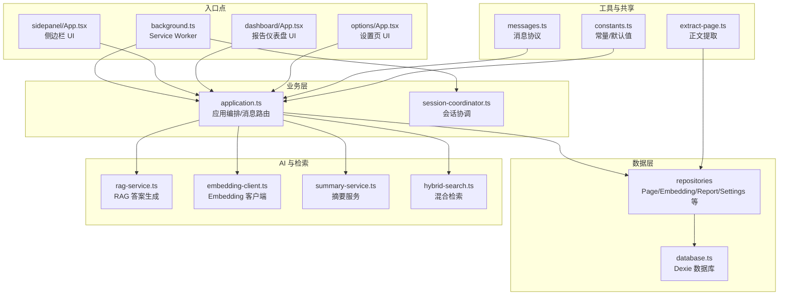
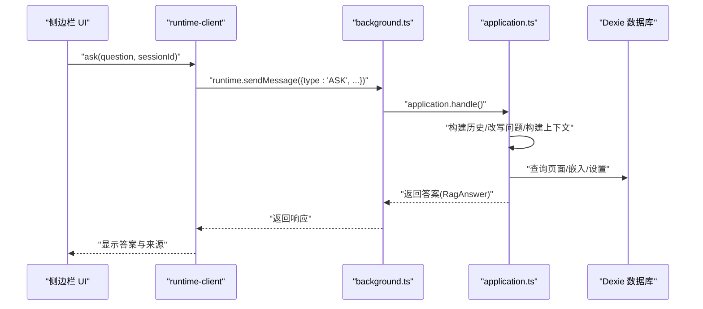
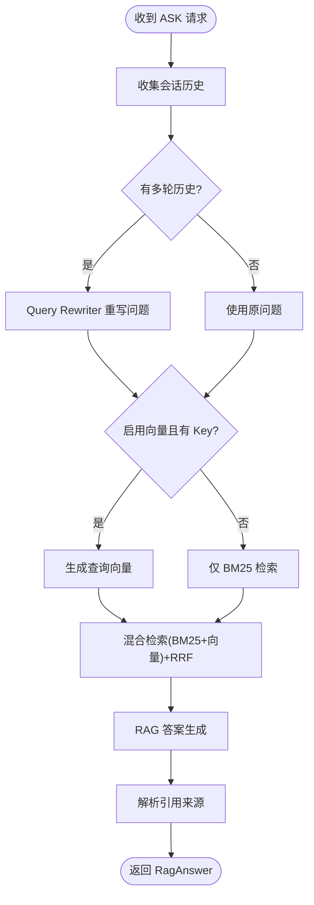
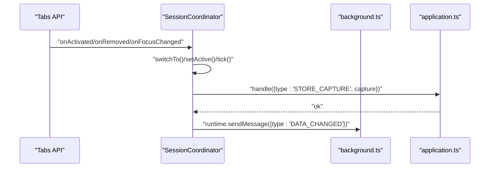
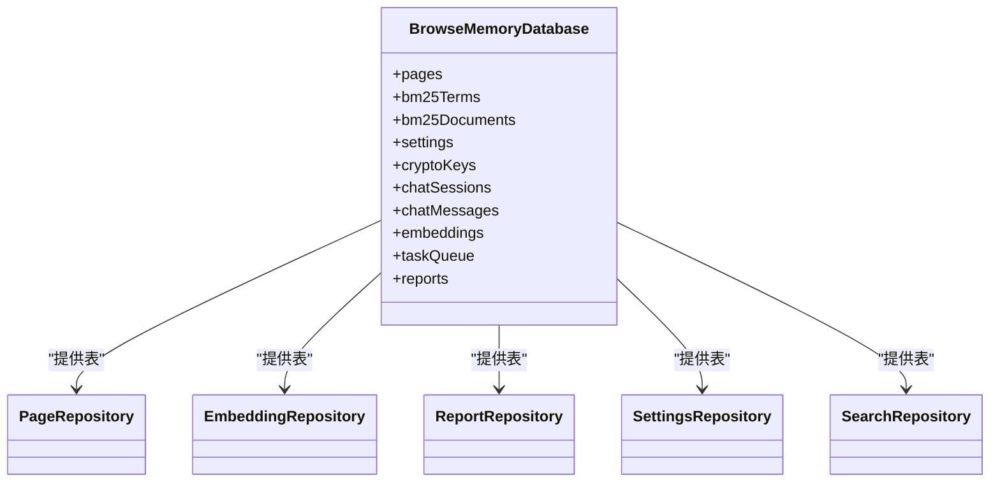
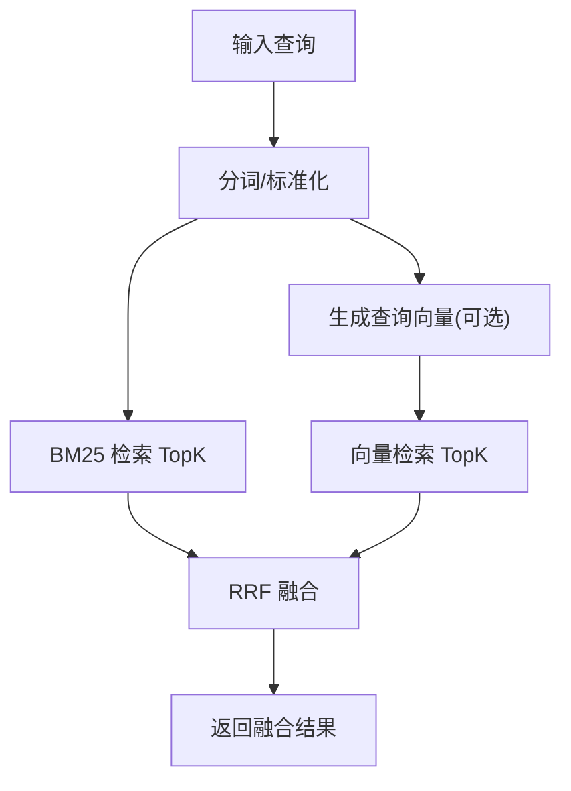
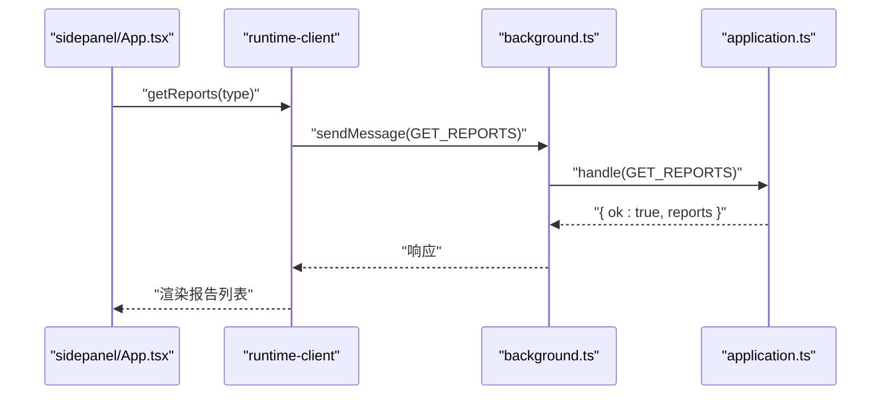
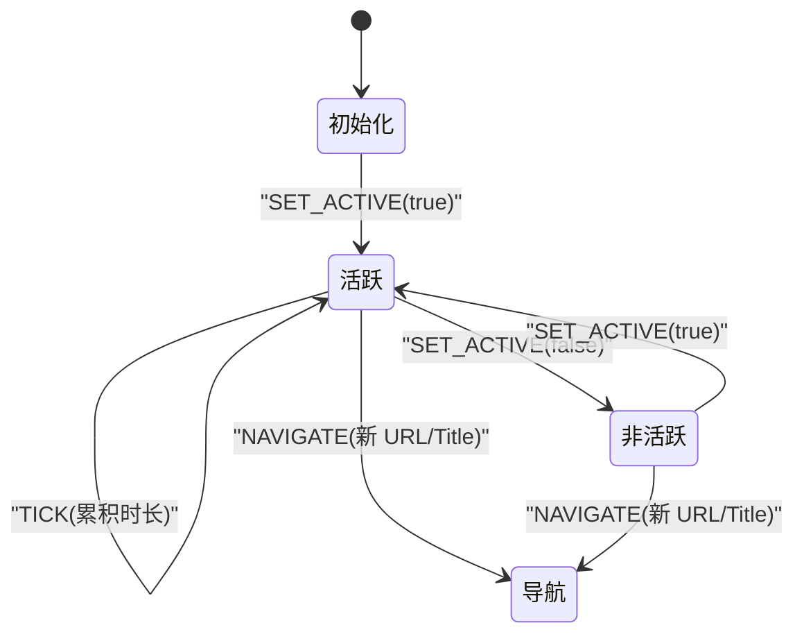
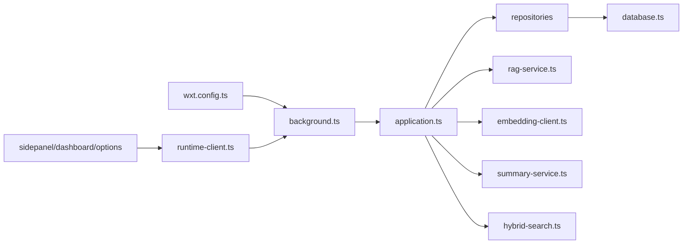

# 项目概述

<cite>
**本文档引用的文件**
- [README.md](file://README.md)
- [package.json](file://package.json)
- [wxt.config.ts](file://wxt.config.ts)
- [entrypoints/background.ts](file://entrypoints/background.ts)
- [src/background/application.ts](file://src/background/application.ts)
- [src/capture/session-machine.ts](file://src/capture/session-machine.ts)
- [src/storage/database.ts](file://src/storage/database.ts)
- [src/ai/rag-service.ts](file://src/ai/rag-service.ts)
- [src/search/hybrid-search.ts](file://src/search/hybrid-search.ts)
- [entrypoints/dashboard/App.tsx](file://entrypoints/dashboard/App.tsx)
- [entrypoints/sidepanel/App.tsx](file://entrypoints/sidepanel/App.tsx)
- [src/ui/runtime-client.ts](file://src/ui/runtime-client.ts)
- [src/extraction/extract-page.ts](file://src/extraction/extract-page.ts)
- [src/shared/constants.ts](file://src/shared/constants.ts)
</cite>

## 目录
1. [简介](#简介)
2. [项目结构](#项目结构)
3. [核心组件](#核心组件)
4. [架构总览](#架构总览)
5. [详细组件分析](#详细组件分析)
6. [依赖关系分析](#依赖关系分析)
7. [性能考量](#性能考量)
8. [故障排查指南](#故障排查指南)
9. [结论](#结论)
10. [附录](#附录)

## 简介
BrowseMemory 是一款本地优先的 Chrome 浏览器扩展，旨在为用户提供“本地记忆 + AI 增强”的智能阅读体验。其核心使命是帮助用户在本地安全地记录、检索与回顾自己的浏览历史与阅读内容，并通过可选的 AI 能力实现更自然的问答与报告生成。项目采用 Chrome MV3 扩展架构，结合分层设计与事件驱动机制，确保在隐私保护的前提下提供流畅、可扩展的功能体验。

- 核心功能特性
  - 自动页面捕获与阅读时长统计
  - 本地 IndexedDB 存储（Dexie）
  - 中英文 BM25 离线全文检索
  - OpenAI 兼容的单轮 RAG 问答与来源引用
  - AES-GCM 加密 API Key
  - 侧边栏与设置页的“安静玻璃”风格界面
  - SPA 页面检测（pushState + popstate + MutationObserver）

- 技术价值主张
  - 本地优先：所有数据与处理均在本地完成，不上传至云端
  - 隐私优先：不申请敏感权限，隐身页面默认不采集，API Key 加密存储
  - 可扩展性：Phase 1/2 渐进式演进，支持语义搜索、离线任务队列、AI 报告等
  - 易用性：简洁直观的 UI、键盘快捷键、自动刷新与增量加载

- 目标用户与使用场景
  - 学习者与研究者：快速检索过往阅读笔记，进行跨日、跨主题的回顾
  - 内容创作者：基于阅读积累生成周报/月报，沉淀知识体系
  - 知识工作者：在大量阅读后进行问答与总结，提升信息利用效率
  - 注重隐私的用户：希望在本地掌控个人阅读数据，避免云端泄露风险

- 技术栈概览
  - 框架与构建：WXT（基于 Vite 的 Chrome 扩展开发框架）
  - 前端：React + TailwindCSS（UI 组件与样式）
  - 数据层：Dexie（IndexedDB 封装）
  - 搜索与检索：BM25（本地倒排索引）+ 可选向量检索（RAG）
  - AI 服务：OpenAI 兼容接口（聊天、嵌入、摘要、查询改写）
  - 任务与调度：离线任务队列 + Chrome Alarms
  - 安全：AES-GCM 加密 API Key

**章节来源**
- [README.md:1-135](file://README.md#L1-L135)

## 项目结构
项目采用“入口点 + 分层模块”的组织方式，清晰分离 UI、业务逻辑、数据与 AI 能力，便于维护与扩展。

**图示来源**
- [entrypoints/background.ts:1-241](file://entrypoints/background.ts#L1-L241)
- [src/background/application.ts:1-388](file://src/background/application.ts#L1-L388)
- [src/storage/database.ts:1-80](file://src/storage/database.ts#L1-L80)
- [src/ai/rag-service.ts:1-66](file://src/ai/rag-service.ts#L1-L66)
- [src/search/hybrid-search.ts:1-78](file://src/search/hybrid-search.ts#L1-L78)
- [entrypoints/sidepanel/App.tsx:1-834](file://entrypoints/sidepanel/App.tsx#L1-L834)
- [entrypoints/dashboard/App.tsx:1-208](file://entrypoints/dashboard/App.tsx#L1-L208)

**章节来源**
- [README.md:94-115](file://README.md#L94-L115)
- [wxt.config.ts:1-19](file://wxt.config.ts#L1-L19)

## 核心组件
- 应用编排（BrowseMemoryApplication）
  - 聚合仓储与服务，统一处理来自 UI 的运行时请求
  - 提供搜索、问答、会话管理、报告生成、嵌入回填等能力
  - 支持清理过期数据、测试连接、获取存储用量等运维能力

- 会话协调（SessionCoordinator）
  - 跟踪当前活跃标签页，维护阅读会话状态
  - 响应标签页切换、窗口焦点变化、页面变更等事件
  - 触发页面捕获与数据变更通知

- 数据库与仓储（Dexie + Repositories）
  - 三层数据库版本迁移，涵盖页面、BM25 索引、聊天、嵌入、任务队列、报告等表
  - 仓储封装 CRUD 与领域查询，屏蔽底层存储细节

- 搜索与检索（BM25 + 可选向量）
  - 本地 BM25 检索，支持中英文分词与片段高亮
  - 可选向量检索（Cosine Similarity）与 RRF 融合，提供更精准结果
  - 问答时根据是否在线与配置决定是否启用向量检索

- AI 与 RAG（OpenAI 兼容）
  - RAG 答案生成：构建上下文、调用模型、解析引用
  - Embedding 客户端：异步生成向量并持久化
  - 摘要服务：为新入库页面生成简短摘要
  - 查询改写：多轮对话中将代词还原为具体实体

- UI 客户端桥接（runtime-client）
  - 通过 chrome.runtime.sendMessage 与后台通信
  - 统一错误包装 BrowseMemoryError，便于 UI 展示与引导

**章节来源**
- [src/background/application.ts:1-388](file://src/background/application.ts#L1-L388)
- [entrypoints/background.ts:1-241](file://entrypoints/background.ts#L1-L241)
- [src/storage/database.ts:1-80](file://src/storage/database.ts#L1-L80)
- [src/ai/rag-service.ts:1-66](file://src/ai/rag-service.ts#L1-L66)
- [src/search/hybrid-search.ts:1-78](file://src/search/hybrid-search.ts#L1-L78)
- [src/ui/runtime-client.ts:1-182](file://src/ui/runtime-client.ts#L1-L182)

## 架构总览
BrowseMemory 采用 Chrome MV3 扩展的典型分层架构：
- Service Worker（background.ts）：事件驱动、定时任务、消息路由、会话协调
- 内容脚本（content.ts）：页面上下文中的正文提取与事件上报（由入口点定义）
- UI 页面（sidepanel/options/dashboard）：React SPA，通过 runtime-client 与后台通信
- 数据层：Dexie 封装 IndexedDB，提供事务与版本迁移
- AI 与检索：独立模块，按需启用，保证本地优先

**图示来源**
- [entrypoints/background.ts:226-239](file://entrypoints/background.ts#L226-L239)
- [src/background/application.ts:178-251](file://src/background/application.ts#L178-L251)
- [src/ui/runtime-client.ts:93-104](file://src/ui/runtime-client.ts#L93-L104)

## 详细组件分析

### 应用编排（BrowseMemoryApplication）
- 职责边界
  - 接收运行时请求（搜索、问答、会话、报告、设置等）
  - 组合仓储与服务，执行业务规则（如多轮对话改写、向量检索降级）
  - 管理任务队列与异步流程（嵌入回填、摘要生成、报告生成）
- 关键流程
  - 问答流程：构建历史 -> 查询改写 -> 向量检索（可选）-> 混合检索 -> RAG 答案 -> 解析引用
  - 报告流程：按类型生成（日/周/月），支持手动触发与定时任务
  - 设置流程：加密保存 API Key，测试连接，读取状态

**图示来源**
- [src/background/application.ts:178-251](file://src/background/application.ts#L178-L251)
- [src/ai/rag-service.ts:18-64](file://src/ai/rag-service.ts#L18-L64)
- [src/search/hybrid-search.ts:57-77](file://src/search/hybrid-search.ts#L57-L77)

**章节来源**
- [src/background/application.ts:1-388](file://src/background/application.ts#L1-L388)

### 会话协调（SessionCoordinator）
- 职责
  - 维护当前活跃标签页与阅读会话
  - 监听标签页激活/移除/窗口焦点变化
  - 在页面变更时触发捕获与数据变更通知
- 设计要点
  - 使用 session storage 保持会话状态
  - 通过 runtime.sendMessage 通知 UI 刷新

**图示来源**
- [entrypoints/background.ts:180-194](file://entrypoints/background.ts#L180-L194)
- [entrypoints/background.ts:57-67](file://entrypoints/background.ts#L57-L67)
- [entrypoints/background.ts:226-239](file://entrypoints/background.ts#L226-L239)

**章节来源**
- [entrypoints/background.ts:1-241](file://entrypoints/background.ts#L1-L241)

### 数据层（Dexie + Repositories）
- 数据库版本迁移
  - 版本 1：页面、BM25 索引、设置、加密密钥
  - 版本 2：新增聊天会话与消息
  - 版本 3：新增嵌入、任务队列、报告
- 仓储职责
  - PageRepository：Upsert 捕获、按日期查询、统计快照
  - EmbeddingRepository：向量持久化、回填状态
  - ReportRepository：报告列表与详情
  - SettingsRepository：应用设置与密钥管理
  - SearchRepository：BM25 检索与片段生成

**图示来源**
- [src/storage/database.ts:34-76](file://src/storage/database.ts#L34-L76)

**章节来源**
- [src/storage/database.ts:1-80](file://src/storage/database.ts#L1-L80)

### 搜索与检索（BM25 + 向量 + RRF）
- BM25
  - 本地倒排索引，支持中英文分词
  - 片段生成与高亮
- 向量检索
  - Cosine Similarity 计算
  - 暴露向量搜索与 RRF 融合接口
- 混合检索
  - 当启用向量时，与 BM25 结果通过 RRF 融合排序
  - 向量不可用时静默降级为纯 BM25

**图示来源**
- [src/search/hybrid-search.ts:13-77](file://src/search/hybrid-search.ts#L13-L77)

**章节来源**
- [src/search/hybrid-search.ts:1-78](file://src/search/hybrid-search.ts#L1-L78)

### UI 与客户端桥接（SidePanel/Dashboard + runtime-client）
- 侧边栏
  - 记忆视图：今日快照、按天分组的阅读记录、域名聚合
  - 对话视图：会话列表、消息流、输入框与发送
  - 报告入口：打开仪表盘 iframe，支持日/周/月切换
- 仪表盘
  - 报告列表、详情渲染（Markdown）、主题标签
  - 手动生成与错误提示
- runtime-client
  - 统一封装消息发送与错误处理
  - 提供快照、搜索、问答、会话、报告、队列状态等 API

**图示来源**
- [entrypoints/sidepanel/App.tsx:13-53](file://entrypoints/sidepanel/App.tsx#L13-L53)
- [entrypoints/dashboard/App.tsx:33-58](file://entrypoints/dashboard/App.tsx#L33-L58)
- [src/ui/runtime-client.ts:136-143](file://src/ui/runtime-client.ts#L136-L143)

**章节来源**
- [entrypoints/sidepanel/App.tsx:1-834](file://entrypoints/sidepanel/App.tsx#L1-L834)
- [entrypoints/dashboard/App.tsx:1-208](file://entrypoints/dashboard/App.tsx#L1-L208)
- [src/ui/runtime-client.ts:1-182](file://src/ui/runtime-client.ts#L1-L182)

### 页面捕获与正文提取
- 会话状态机
  - 维护 tabId/url/title/duration/active 等字段
  - TICK/SET_ACTIVE/NAVIGATE 事件驱动状态转换
- 正文提取
  - 基于 Mozilla Readability，提供稳定可靠的正文抽取
  - 异常兜底，确保即使解析失败也能返回标题与空内容

**图示来源**
- [src/capture/session-machine.ts:15-69](file://src/capture/session-machine.ts#L15-L69)

**章节来源**
- [src/capture/session-machine.ts:1-69](file://src/capture/session-machine.ts#L1-L69)
- [src/extraction/extract-page.ts:1-26](file://src/extraction/extract-page.ts#L1-L26)

## 依赖关系分析
- 外部依赖
  - WXT：提供 MV3 扩展开发环境与构建配置
  - React/Tailwind：UI 框架与样式系统
  - Dexie：IndexedDB 封装，简化本地存储
  - @mozilla/readability：正文提取
  - Radix UI：基础 UI 控件
- 内部模块耦合
  - background.ts 依赖 application.ts 与各仓库/服务
  - UI 通过 runtime-client 与 background 交互，低耦合
  - 搜索与 AI 模块可插拔，不影响核心流程

**图示来源**
- [wxt.config.ts:1-19](file://wxt.config.ts#L1-L19)
- [entrypoints/background.ts:1-241](file://entrypoints/background.ts#L1-L241)
- [src/background/application.ts:1-388](file://src/background/application.ts#L1-L388)
- [src/ui/runtime-client.ts:1-182](file://src/ui/runtime-client.ts#L1-L182)

**章节来源**
- [package.json:14-46](file://package.json#L14-L46)
- [wxt.config.ts:1-19](file://wxt.config.ts#L1-L19)

## 性能考量
- 检索性能
  - BM25 本地索引，适合中小规模数据；向量检索在文档数 < 10K 时可接受
  - RRF 融合降低复杂度，兼顾召回与相关性
- 离线与异步
  - 任务队列与 Alarms 实现离线回填（嵌入、摘要、报告），避免阻塞主线程
  - API Key 加密存储，减少明文访问带来的性能损耗
- UI 体验
  - 侧边栏按天懒加载、域名折叠、搜索防抖，提升大体量数据下的交互流畅度
  - 仪表盘通过 iframe 与主界面隔离，避免重复渲染

[本节为通用性能建议，不直接分析特定文件]

## 故障排查指南
- 常见问题与定位
  - 问答无结果或降级：检查 API Key 是否配置、网络状态、向量服务可用性
  - 搜索为空：确认页面是否被采集（隐身页默认不采集）、黑名单过滤、保留天数
  - 报告无法生成：确认 API Key、时间参数、任务队列状态
  - 侧边栏无更新：确认 DATA_CHANGED 消息是否到达、Alarms 是否正常触发
- 错误处理
  - runtime-client 统一抛出 BrowseMemoryError，UI 可据此展示友好提示并引导去设置页
  - application.ts 对缺失 Key、向量失败等场景进行非致命降级

**章节来源**
- [src/ui/runtime-client.ts:12-24](file://src/ui/runtime-client.ts#L12-L24)
- [src/background/application.ts:130-177](file://src/background/application.ts#L130-L177)
- [entrypoints/background.ts:195-225](file://entrypoints/background.ts#L195-L225)

## 结论
BrowseMemory 以“本地优先 + AI 增强”为核心理念，通过清晰的分层架构与事件驱动机制，实现了从页面捕获到检索问答再到报告生成的完整闭环。其隐私保护策略与数据本地化优势，使其成为注重隐私与效率的用户的理想选择。随着 Phase 2 的推进，项目将持续引入语义搜索、离线任务队列与报告自动化等能力，进一步提升智能化水平与用户体验。

[本节为总结性内容，不直接分析特定文件]

## 附录

### 隐私保护与数据本地化
- 数据存储：仅在扩展自身的 IndexedDB 中保存浏览正文、索引、设置与聊天记录
- API Key：使用不可导出的 AES-GCM 加密存储，传输时走 HTTPS
- 权限最小化：不申请 history、cookies、webRequest 权限
- 隐身模式：默认不采集隐身页面
- 降级策略：未配置 Embedding 或 API 报错时，自动降级为纯 BM25 搜索

**章节来源**
- [README.md:117-125](file://README.md#L117-L125)

### 默认设置与常量
- 黑名单模式：银行、支付、密码管理等站点默认不采集
- 保留天数：默认 90 天
- 报告生成时间：默认每日凌晨 3 点
- 任务重试与退避：最多 3 次，间隔 1 分钟、5 分钟、30 分钟

**章节来源**
- [src/shared/constants.ts:3-33](file://src/shared/constants.ts#L3-L33)